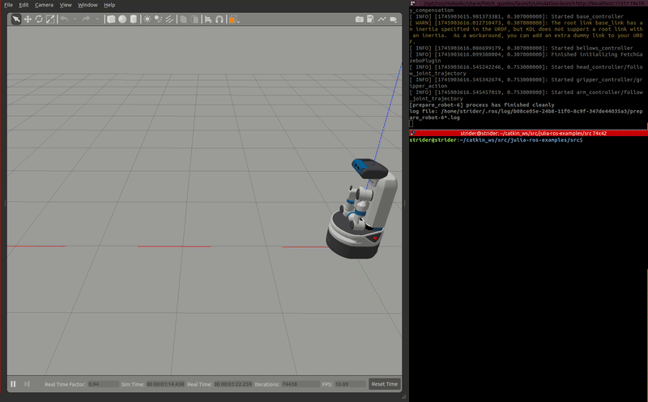

# Julia ROS Examples 🚀

This repository shows examples in how to integrate Julia with the Robot Operating System (ROS) using the [RobotOS.jl](https://github.com/jdlangs/RobotOS.jl) package. 

## Setup & Installation

### Prerequisites

- **Operating System**: Ubuntu 18.04 (Bionic)
- **ROS Distribution**: ROS Melodic
- **Julia Version**: 1.x (tested with Julia 1.11.5)

### Julia Package Installation

1. **Install Julia**: Follow the official instructions at [julialang.org](https://julialang.org/downloads/).

2. **Add Required Packages**:

    Run `Julia` in your terminal the run the following commands:

   ```julia
   using Pkg
   Pkg.add("RobotOS")
   Pkg.add("PyCall")
   ```

### ROS Workspace Setup

1. **Clone the Repository into Your Catkin Workspace**:

   ```bash
   cd ~/catkin_ws/src
   git clone https://github.com/alan-sanchez/julia-ros-examples.git
   ```

2. **Build the Workspace**:

   ```bash
   cd ~/catkin_ws
   catkin_make
   ```

3. **Source the Workspace**:

   ```bash
   source devel/setup.bash
   ```

## Running the Examples

1. **Running a Simple Publisher and Subcriber Node**:

    Before running this example, run the ROS master in a terminal:

    ```bash
    # terminal 1
    roscore
    ```

    Then, in a new terminal, navigate to the package's src directory and run the Julia script, [**talker**](src/talker.jl). 

    ```bash
    # terminal 2
    cd ~/catkin_ws/src/julia-ros-examples/src
    julia talker.jl
    ```

    In a third terminal, navigate to the src directory again and run the [**listener**](src/listener.jl) node

    ```bash
    # terminal 3
    cd ~/catkin_ws/src/julia-ros-examples/src
    julia listener.jl
    ```
    The gif below demonstrates what you should see in your terminals

    

2. **Move a Robot Forward**:
    For this example, I used a node to move a Fetch mobile manipulator in Gazebo. This node can be adapted to be used with other robotic platforms, so long as you modify the code to the appropriate topic name to send `twist` commands to the base. 

    If you wish to run this with the Fetch robot in Gazebo, make sure to install the [packages](https://github.com/ZebraDevs/fetch_gazebo) that are appropriate for your system.

    To bringup the Fetch robot in a simple simulation environment, run the following in a terminal:
    ```bash
    # terminal 1
    roslaunch fetch_gazebo simulation.launch 
    ```

    In another terminal, navigate to the src directory and run the [**move**](src/move.jl) node by typing the following:

     ```bash
    # terminal 2
    cd ~/catkin_ws/src/julia-ros-examples/src
    julia move.jl
    ```
    To stop the robot, type **Ctrl + c** in the same terminal (terminal 2) where you executed the move node.

    You should see the same behavior like in the clip below. 

    


## Other Resources

- **RobotOS.jl Documentation**: [https://jdlangs.github.io/RobotOS.jl/latest/](https://jdlangs.github.io/RobotOS.jl/latest/)
- **ROS Melodic Installation Guide**: [http://wiki.ros.org/melodic/Installation/Ubuntu](http://wiki.ros.org/melodic/Installation/Ubuntu)


<!-- 
Pkg.add("RobotOS") [link](https://github.com/jdlangs/RobotOS.jl)

debugging

Pkg.add("PyCall") 

[Tutorial reference](https://github.com/mattborghi/ros-julia-examples)

[RobotOS API](https://github.com/jdlangs/RobotOS.jl/blob/master/docs/src/api.md) and [index](https://github.com/jdlangs/RobotOS.jl/blob/master/docs/src/index.md) that further explains the api -->

